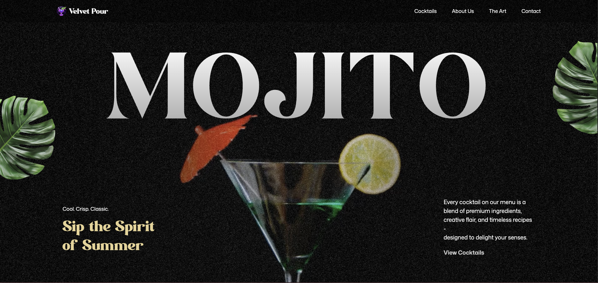

# 🍹 Mojito Awwwards Website

An immersive, animation-driven website inspired by modern Awwwards-style experiences. Built with React and GSAP, this project focuses on high-impact motion design, scroll-based storytelling, and interactive UI elements.

## ✨ Technologies

- React
- TypeScript
- GSAP (GreenSock)
- Tailwind CSS
- Vite

## 🚀 Features

- Smooth, timeline-based animations powered by GSAP
- ScrollTrigger-driven interactions for dynamic storytelling
- SplitText animations for engaging text reveals
- Parallax scrolling for depth and immersion
- Pinned sections for cinematic transitions
- Scroll-synced animations across multiple sections
- Custom animated carousel with navigation controls
- Image masking and reveal effects
- Responsive layout across screen sizes

## 📍 The Process

This project marks my first time working with GSAP and applying advanced animation techniques in a real project. I wanted to move beyond static interfaces and explore how motion can enhance user experience—taking inspiration from Awwwards-style websites.

I spent time learning the fundamentals of GSAP, especially timelines and ScrollTrigger, and how they can be used together to create smooth, scroll-driven interactions. One of the main challenges was coordinating multiple animations across different sections while keeping everything performant and visually consistent.

Although this project is based on a tutorial, I used it as an opportunity to genuinely learn GSAP and turn that knowledge into a polished portfolio piece.

## 🎯 What I Learned

- How to integrate GSAP with React using hooks
- Structuring complex animation timelines
- Creating scroll-driven user experiences with ScrollTrigger
- Managing performance in animation-heavy interfaces
- Combining Tailwind with animation libraries for fast UI development

## 📸 Preview

